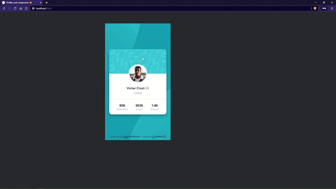
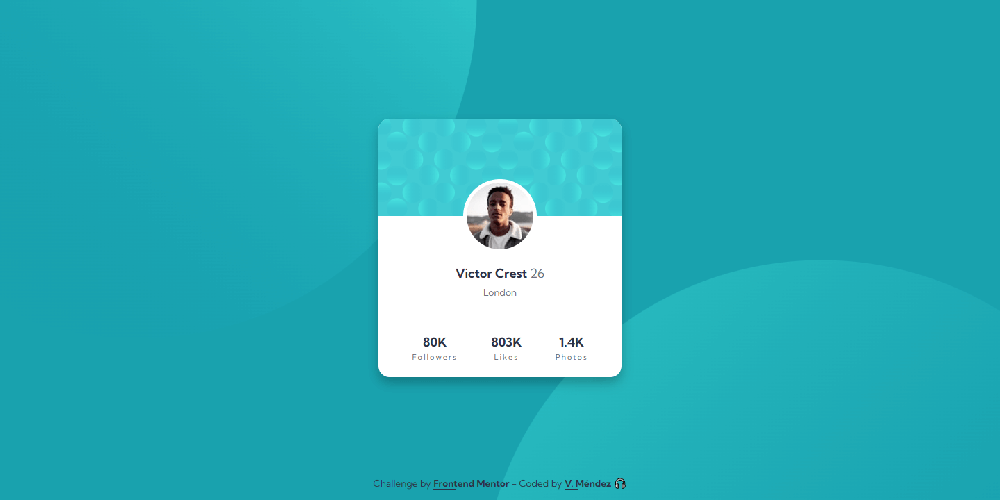

# Frontend Mentor - Profile card component solution

Hi everyone 👋

This is a solution to the [Profile card component challenge on Frontend Mentor](https://www.frontendmentor.io/challenges/profile-card-component-cfArpWshJ).

## Table of contents

  - [The challenge](#the-challenge)
  - [Screenshot](#screenshot)
  - [Link](#link)
  - [Built with](#built-with)
  - [Author](#author)

## **The challenge**

- Build out the project to the designs provided

## **Screenshot**

## **Link**

- [Live site URL here 👀](https://irismendez.github.io/profile-card-component/)

## **Built with**

✔ Mobile-first workflow

✔ Semantic HTML5 markup

✔ CSS custom properties

✔ Flexbox

✔ CSS Grid

## **Author**

✨- Frontend Mentor - [@irismendez](https://www.frontendmentor.io/profile/irismendez)

✨ DevChallenges - [@irismendez](https://devchallenges.io/portfolio/irismendez)

✨ Twitter - [@irismendez_](https://twitter.com/irismendez_)